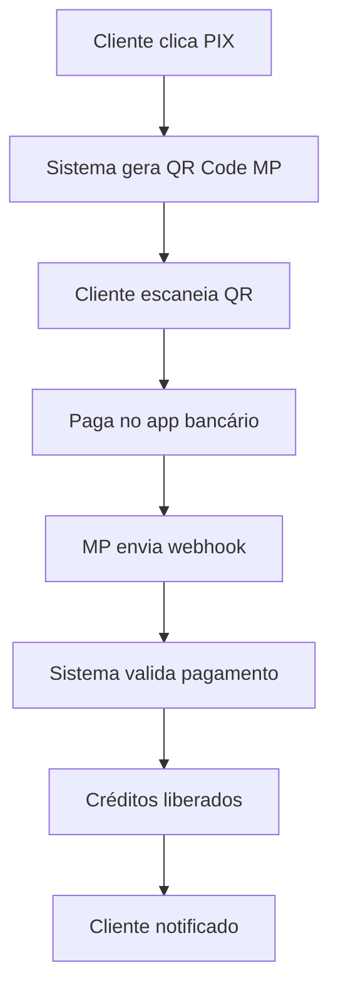
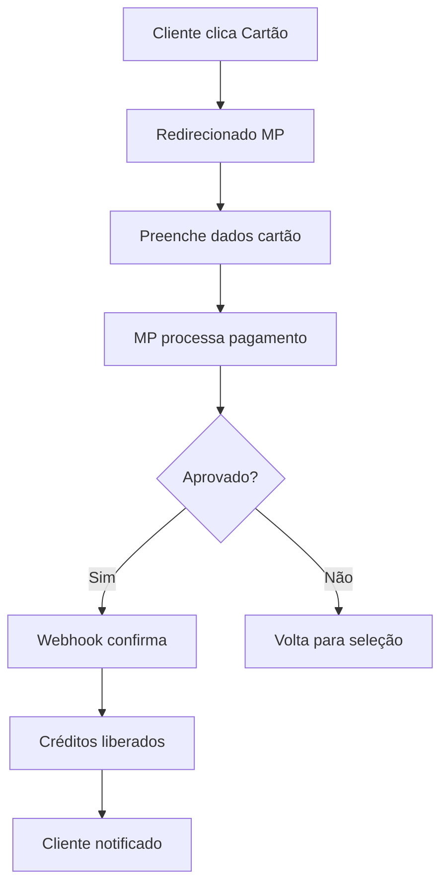

# 💳 Sistema de Pagamento Real - Fidelidade Ordinário Bar

## 🏢 Informações do Negócio

### Dados Cadastrais
- **Razão Social**: Ordinário Bar Ltda
- **CNPJ**: 57.960.083/0001-88
- **Chave PIX**: 57.960.083/0001-88 (CNPJ)
- **Localização**: Brasília/DF
- **Ramo**: Bar e Restaurante

### Programa de Fidelidade
- **Mensalidade**: R$ 100,00
- **Crédito Oferecido**: R$ 150,00
- **Validade**: 30 dias
- **Benefícios**: Acesso VIP, eventos exclusivos, drink do mês

---

## 🔧 Configuração Técnica

### 1. Variáveis de Ambiente (.env.local)

```bash
# =====================================
# MERCADO PAGO - CONFIGURAÇÃO REAL
# =====================================

# CREDENCIAIS PRINCIPAIS
MERCADO_PAGO_ACCESS_TOKEN=APP_USR-1234567890123456-123456-1234567890abcdef1234567890abcdef-123456789
NEXT_PUBLIC_MERCADO_PAGO_PUBLIC_KEY=APP_USR-1234567a-1234-1234-1234-123456789012
MERCADO_PAGO_COLLECTOR_ID=123456789
MERCADO_PAGO_WEBHOOK_SECRET=webhook_secret_here

# URL APLICAÇÃO (OBRIGATÓRIO)
NEXT_PUBLIC_APP_URL=https://sgb-ordinario.vercel.app

# DADOS NEGÓCIO
BUSINESS_PIX_KEY=57.960.083/0001-88
BUSINESS_NAME="Ordinário Bar"
BUSINESS_CNPJ=57960083000188

# =====================================
# PARA TESTE (USAR PRIMEIRO)
# =====================================

# CREDENCIAIS TESTE
MERCADO_PAGO_ACCESS_TOKEN=TEST-1234567890123456-123456-1234567890abcdef1234567890abcdef-123456789
NEXT_PUBLIC_MERCADO_PAGO_PUBLIC_KEY=TEST-1234567a-1234-1234-1234-123456789012
MERCADO_PAGO_COLLECTOR_ID=123456789
NEXT_PUBLIC_APP_URL=http://localhost:3000
```

### 2. Como Obter Credenciais Mercado Pago

#### A. Criar Conta Empresarial
1. **Acessar**: https://www.mercadopago.com.br/
2. **Cadastrar** conta empresarial
3. **Validar CNPJ**: 57.960.083/0001-88
4. **Aguardar** aprovação (1-3 dias úteis)

#### B. Configurar Aplicação
1. **Acessar painel**: https://www.mercadopago.com.br/developers/panel
2. **Criar aplicação** ou usar existente
3. **Copiar credenciais**:
   - Access Token (começando com APP_USR- ou TEST-)
   - Public Key (começando com APP_USR- ou TEST-)
   - Collector ID (número do usuário)

#### C. Configurar Webhooks
1. **No painel MP**, ir em "Webhooks"
2. **Adicionar URL**: `https://seudominio.com/api/fidelidade/pagamento/webhook`
3. **Selecionar eventos**:
   - ✅ `payment`
   - ✅ `merchant_order`
4. **Salvar configuração**

---

## 💰 Estrutura de Valores

### Tabela de Preços
| Item | Valor | Observação |
|------|--------|------------|
| Mensalidade VIP | R$ 100,00 | Valor fixo mensal |
| Crédito Concedido | R$ 150,00 | 50% de bônus |
| Lucro Líquido | R$ 50,00 | Margem de 50% |

### Taxas por Método
| Método | Taxa MP | Valor Líquido | Tempo |
|---------|---------|---------------|--------|
| **PIX** | 0,99% | R$ 99,01 | Instantâneo |
| **Cartão à Vista** | 3,99% | R$ 96,01 | 1 dia útil |
| **Cartão Parcelado** | 4,99% + juros | Variável | 30-40 dias |

---

## 🔒 Segurança e Compliance

### Dados Protegidos
- ✅ **SSL/TLS** obrigatório em produção
- ✅ **PCI DSS** compliance via Mercado Pago
- ✅ **LGPD** - dados pessoais criptografados
- ✅ **Webhook signature** validation
- ✅ **Rate limiting** nas APIs

### Validações Implementadas
- ✅ **CPF** válido do cliente
- ✅ **E-mail** único por conta
- ✅ **Telefone** brasileiro
- ✅ **Transações** duplicadas bloqueadas
- ✅ **Timeout** de pagamento (30min PIX, 24h cartão)

---

## 🚀 Fluxo de Pagamento Detalhado

### PIX (Recomendado)


**Vantagens PIX**:
- ✅ Instantâneo (segundos)
- ✅ Menor taxa (0,99%)
- ✅ Disponível 24/7
- ✅ Sem chargeback

### Cartão de Crédito


**Vantagens Cartão**:
- ✅ Familiar para clientes
- ✅ Parcelamento disponível
- ✅ Proteção contra fraude
- ⚠️ Taxa maior (3,99%+)

---

## 📊 Monitoramento e Relatórios

### Tabelas do Banco
```sql
-- Pagamentos realizados
SELECT 
    p.id,
    m.nome as cliente,
    p.valor,
    p.metodo_pagamento,
    p.status,
    p.created_at,
    p.gateway_transaction_id
FROM fidelidade_pagamentos p
JOIN fidelidade_membros m ON p.membro_id = m.id
WHERE p.created_at >= CURRENT_DATE - INTERVAL '30 days'
ORDER BY p.created_at DESC;

-- Resumo financeiro mensal
SELECT 
    DATE_TRUNC('month', created_at) as mes,
    COUNT(*) as total_pagamentos,
    SUM(valor) as receita_bruta,
    metodo_pagamento,
    status
FROM fidelidade_pagamentos
GROUP BY mes, metodo_pagamento, status
ORDER BY mes DESC;

-- Membros ativos
SELECT 
    COUNT(*) as membros_ativos,
    SUM(saldo_atual) as creditos_em_circulacao
FROM fidelidade_membros
WHERE status = 'ativo';
```

### Métricas Importantes
- **Taxa de Conversão**: % de cadastros que pagam
- **Ticket Médio**: R$ 100,00 (fixo)
- **Churn Rate**: % cancelamentos mensais
- **LTV**: Lifetime Value por cliente
- **ROI**: Retorno sobre investimento

---

## 🧪 Ambiente de Teste

### 1. Configuração Teste
```bash
# Use estas credenciais para testar
MERCADO_PAGO_ACCESS_TOKEN=TEST-1234567890123456-123456-1234567890abcdef
NEXT_PUBLIC_MERCADO_PAGO_PUBLIC_KEY=TEST-1234567a-1234-1234-1234-123456789012
NEXT_PUBLIC_APP_URL=http://localhost:3000
```

### 2. Cartões de Teste
| Número | Bandeira | Resultado |
|---------|----------|-----------|
| 4235 6477 2802 5682 | Visa | ✅ Aprovado |
| 5031 4332 1540 6351 | Mastercard | ✅ Aprovado |
| 4000 0000 0000 0002 | Visa | ❌ Recusado |
| 4000 0000 0000 0119 | Visa | ❌ Recusado |

**Dados complementares teste**:
- **CVV**: 123
- **Validade**: 12/25
- **Nome**: APRO (aprovado) ou OTHE (recusado)

### 3. PIX de Teste
- QR Code gerado automaticamente
- Simulação de pagamento instantânea
- Webhook disparado automaticamente

---

## 🔧 Deployment e Produção

### 1. Checklist Pré-Produção
- [ ] **Credenciais** de produção configuradas
- [ ] **Webhook URL** apontando para domínio real
- [ ] **SSL** configurado e funcionando
- [ ] **Banco de dados** produção preparado
- [ ] **Testes** completos realizados
- [ ] **Monitoramento** ativo

### 2. Variáveis Produção
```bash
# PRODUÇÃO - NÃO COMMITAR!
MERCADO_PAGO_ACCESS_TOKEN=APP_USR-real_token_here
NEXT_PUBLIC_MERCADO_PAGO_PUBLIC_KEY=APP_USR-real_public_key_here
MERCADO_PAGO_COLLECTOR_ID=real_collector_id
NEXT_PUBLIC_APP_URL=https://sgb-ordinario.vercel.app
```

### 3. URLs Importantes
- **App Principal**: https://sgb-ordinario.vercel.app
- **Webhook**: https://sgb-ordinario.vercel.app/api/fidelidade/pagamento/webhook
- **Success**: https://sgb-ordinario.vercel.app/fidelidade/pagamento/sucesso
- **Error**: https://sgb-ordinario.vercel.app/fidelidade/pagamento/erro

---

## 🆘 Troubleshooting

### Problemas Comuns

#### 1. "Dados do membro não encontrados"
**Causa**: Membro não está logado ou dados corrompidos
**Solução**:
```javascript
// Verificar localStorage
console.log(localStorage.getItem('fidelidade_membro'));

// Se vazio, fazer login novamente
```

#### 2. Erro 400 no Mercado Pago
**Causas possíveis**:
- CPF inválido do cliente
- Telefone em formato incorreto
- Access Token inválido
- Dados obrigatórios faltando

**Solução**:
```javascript
// Validar dados antes de enviar
const cpf = membro.cpf?.replace(/\D/g, '');
if (cpf.length !== 11) {
    throw new Error('CPF inválido');
}
```

#### 3. Webhook não recebido
**Causas**:
- URL webhook incorreta
- Firewall bloqueando
- SSL não configurado
- Timeout na resposta

**Solução**:
- Verificar logs do servidor
- Testar webhook manualmente
- Confirmar URL no painel MP

#### 4. PIX não gera QR Code
**Causas**:
- CNPJ não validado no MP
- Collector ID incorreto
- Conta MP não ativa para PIX

**Solução**:
- Verificar status da conta MP
- Confirmar ativação PIX
- Testar com credenciais teste primeiro

---

## 📞 Contatos e Suporte

### Mercado Pago
- **Documentação**: https://dev.mercadopago.com/
- **Suporte Técnico**: https://www.mercadopago.com.br/ajuda
- **Status API**: https://status.mercadopago.com/
- **Comunidade**: https://github.com/mercadopago

### Ordinário Bar
- **WhatsApp**: (61) 99999-8888
- **E-mail**: fidelidade@ordinariobar.com
- **Suporte Técnico**: dev@ordinariobar.com

---

## 📈 Próximos Passos

### Melhorias Futuras
1. **Assinatura Recorrente** - Cobrança automática
2. **Multi-estabelecimento** - Expandir para outros bares
3. **Cashback** - Programa de pontos
4. **API Mobile** - App dedicado
5. **BI Dashboard** - Relatórios avançados

### Integrações Possíveis
- **WhatsApp Business** - Notificações
- **SMS** - Confirmações
- **E-mail Marketing** - Campanhas
- **POS Integration** - Terminal no bar
- **QR Code Reader** - App para funcionários

---

**🚨 IMPORTANTE**: 
1. **TESTE TUDO** em ambiente de desenvolvimento
2. **NUNCA** commite credenciais reais
3. **MONITORE** todas as transações
4. **BACKUP** dados regularmente
5. **MANTENHA** logs detalhados

**✅ STATUS**: Pronto para implementação
